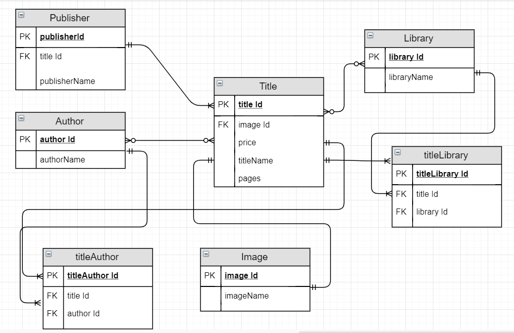
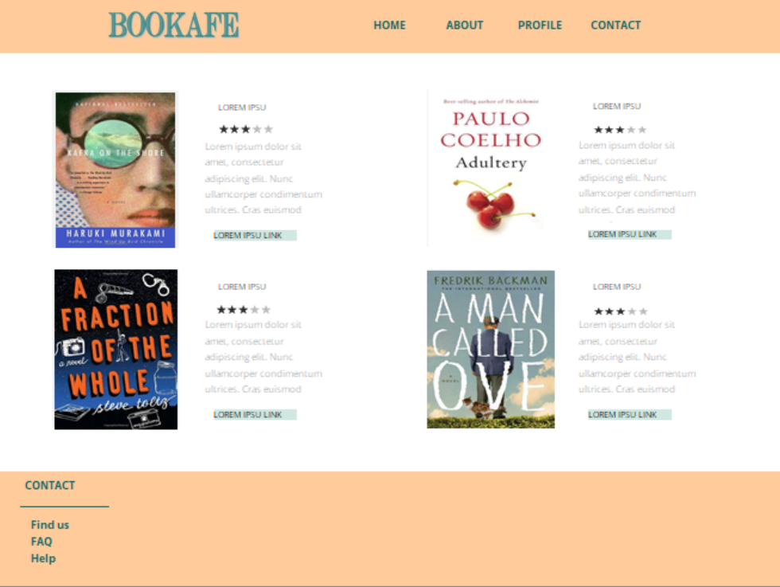
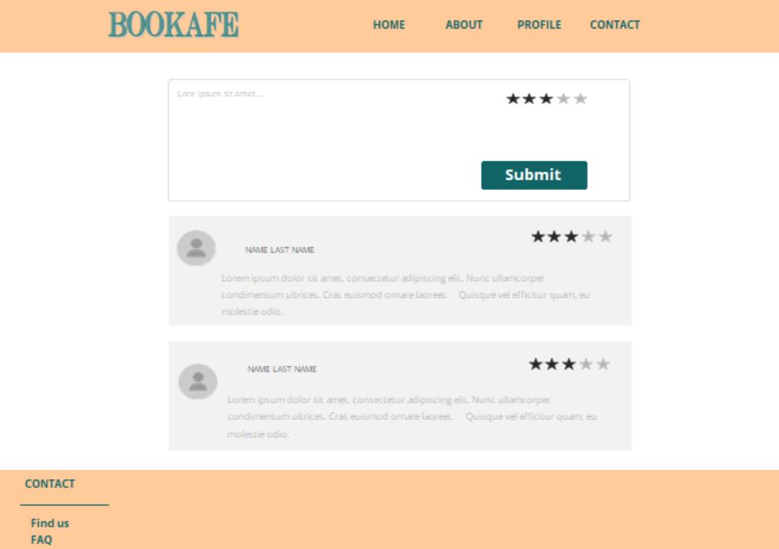
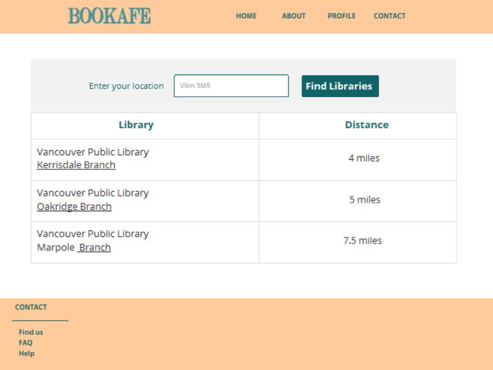
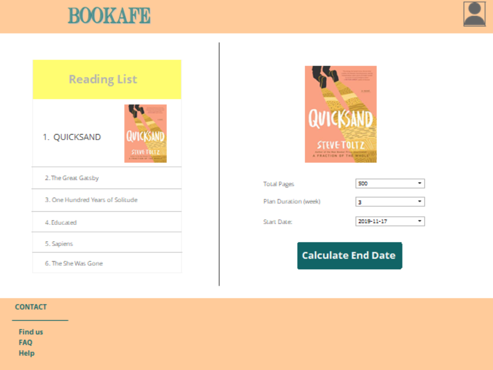

# BOOKAFE

Bookafe is a website for book lovers that provides useful set of information for books. You can find a brief summary and information about the book. If you are interested, you can register into our website and make a profile. Then you choose your reading list, select start date and choose the plan duration (like 3 weeks) for each book and you will receive a reading plan.

## Functional
1.  User Authentication
1.  Search by title and author
1.  Display book information
1.  Email Verification
1.  Save the reading list
1.	Make reading schedule based on page of the book (from title table), start date (from user) and plan duration (from user).

## Non-functional:
1.	Login Security and privacy of user information
1.  24 Hours of Operation
1.	Capacity to store data of 1000 users
1.	Fast and Responsive

## Must have:
1.	Brief Summary
1.	Review
1.	User Registration
1.	Password Reset System
1.	Reading List
1.	Reading plan
1.	Editable Reading List (add/ remove)

## Nice to Have:  

1.  Link to Stores
1. Link to Libraries
1.  Link to Meet-up Groups (if existed)
1.  Notifications and follow ups for the plan
1.  Allow Social Login

## Entity Relationship Diagram

## Prototype 

 

 

 

 

