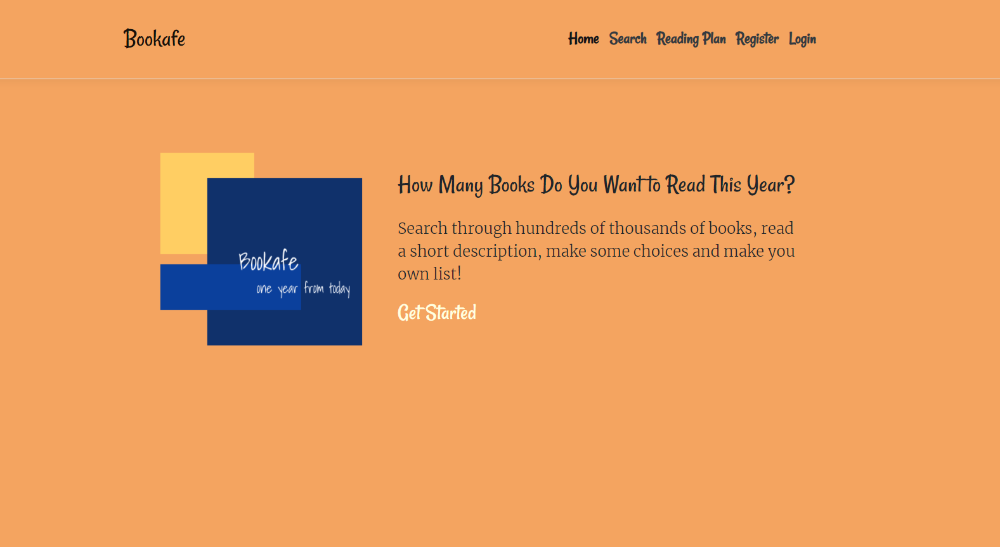
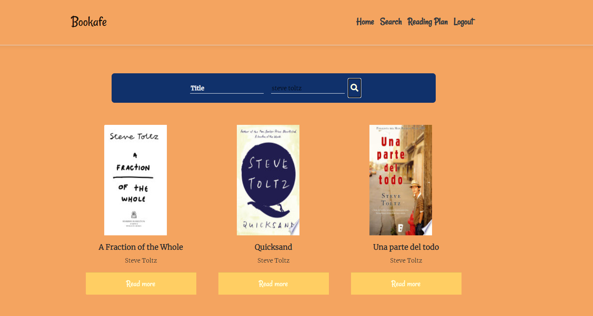
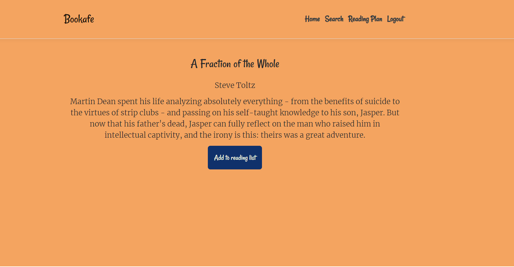
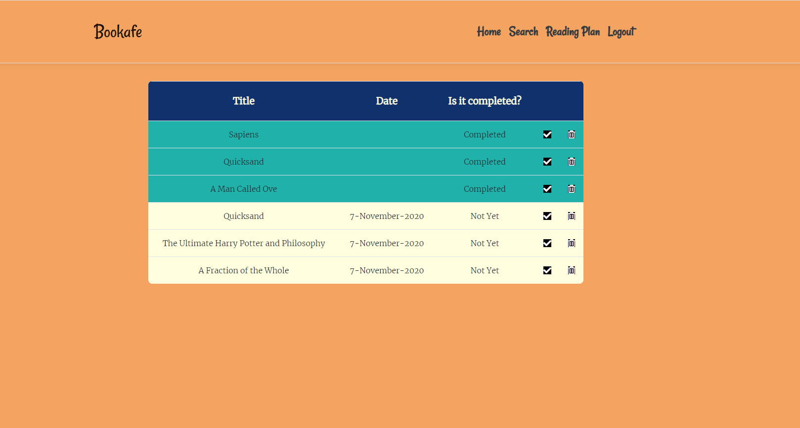

# BOOKAFE
Bookafe is a website for book lovers that provides useful set of information for books. You can find a brief summary and information about the book. If you are interested, you can register into our website and make a profile. Then you can create your own to read list for books.
## Technologies
* **Back-end**: ASP .NET Core Web API 
* **Front-end**: React 
* **Authentication And Authorization**: JSON Web Tokens
* **Database**: SQL server  

## Functional
1.  User Authentication
1.  Search by title and author
1.  Display book information
1.  Save the reading list

## Screenshots:

